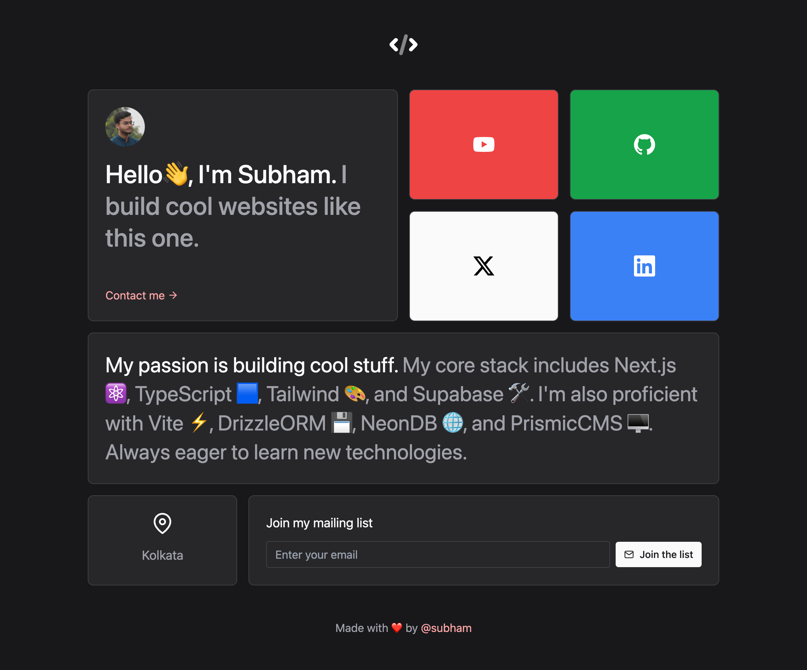

# 🧃 Bento Portfolio


A clean and minimal **Bento-style personal portfolio** built using **React** and **Framer Motion**. This project showcases your personal branding, skills, and contact links in a beautiful animated grid layout inspired by the Bento UI aesthetic.

## 🔗 Live Demo

👉 [View Live](https://subham-paul-portfolio.vercel.app/)

---

## ✨ Features

- 🟪 Bento grid layout with soft UI
- 🎬 Smooth animations with Framer Motion
- 🧑‍💼 Clean personal sections: About, Socials, Contact
- 🎨 Responsive design for mobile and desktop
- ⚡ Lightweight and fast

---

## 🛠️ Tech Stack

- [React](https://reactjs.org/) – Frontend library
- [Framer Motion](https://www.framer.com/motion/) – Animations
- [Vite](https://vitejs.dev/) – Fast development environment
- [Tailwind CSS](https://tailwindcss.com/) – Utility-first CSS

---

## 🚀 Getting Started

Make sure that you have installed
- 🟢 Node.js
- 🐙 Git
- 📦 npm, yarn, pnpm, or bun

1. 📂 Clone the Repository

   ```bash
   git clone https://github.com/ItisSubham/Bento_Portfolio
   cd Bento_Portfolio
   ```
2. 📥 Install Dependencies

   ```bash
   npm install
   ```
3. ▶ Run the Development Server

   ```bash
   npm run dev
   ```
4. 🌐 View the Website
- Open your browser and navigate to http://localhost:3000 to see the website in action.

---

Let me know if you'd like to include a "dark/light mode" toggle or a section for project and tools as cards.
